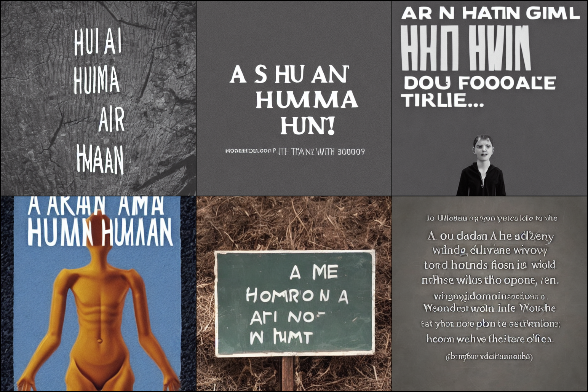
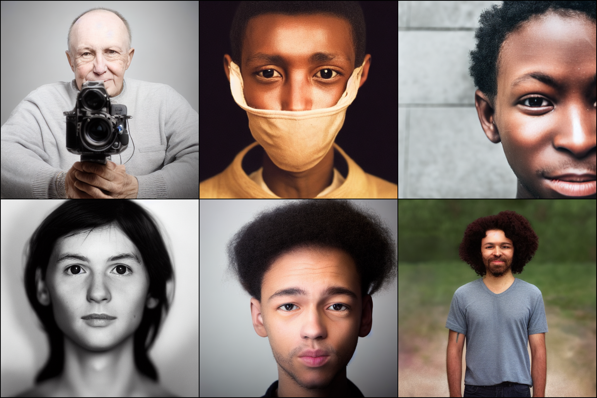

# Censored Sampling of Diffusion Models Using 3 Minutes of Human Feedback

This is the codebase for [**Censored Sampling of Diffusion Models Using 3 Minutes of Human Feedback**](https://arxiv.org/abs/2307.02770).

<p align="center">

</p>

<center> Fig 1. Examples of malign generation from Stable Diffusion v1.4 (with unexpected embedded text) given the prompt <b>"A photo of a human"</b>. About <i>22%</i> are the malign images. </center>

&nbsp;

<p align="center">

</p>

<center> Fig 2. Examples of censored generation (with guidance toward no embedded text, based on human feedback data) from the same model and prompt. About <i>1%</i> are the malign images. </center>

&nbsp;

This repository is based on [openai/guided-diffusion](https://github.com/openai/guided-diffusion), [CompVis/latent-diffusion](https://github.com/CompVis/latent-diffusion) and [CompVis/stable-diffusion](https://github.com/CompVis/stable-diffusion), and provides an implementation of human feedback based guidance framework.
We integrate ideas and components from [arpitbansal297/Universal-Guided-Diffusion](https://github.com/arpitbansal297/Universal-Guided-Diffusion) for guidance, with some necessary modifications.


## Contents
- [Installation](#installation)
- [Experiment 1. MNIST 7 (censoring crossed 7s)](#experiment-1-mnist-7)
- [Experiment 2. LSUN Church (censoring stock watermarks)](#experiment-2-lsun-church)
- [Experiment 3. ImageNet Tench (censoring human faces)](#experiment-3-imagenet-tench)
- [Experiment 4. LSUN Bedroom (censoring broken images)](#experiment-4-lsun-bedroom)
- [Experiment 5. Stable Diffusion (censoring prominent embedded texts given a certain prompt) (Beta version)](#experiment-5-stable-diffusion-beta)


# Installation

Make sure you have Python version **3.9** installed.

Run the following commands:
```
cd latent_guided_diffusion
conda env create -f enviroment.yaml
conda activate ldm
```

Next, install the `guided_diffusion` package that the scripts depend on:

```
cd ..
pip install -e .
```

You may need to separately install `cudatoolkit` within the virtual environment (especially if the experiment procedure below produces errors related to `from torch._C import *`):

```
conda install cudatoolkit=11.8 -c pytorch -c nvidia
```


# Experiment 1. MNIST 7
## 1.1 Prepare training data

Run the following command:
```sh
python datasets/mnist_7.py
```

The script will download the MNIST train dataset, select only the images of the digit 7, resize the images to 32x32, and save them into the `mnist_7` directory.
<!-- 
If you want to use your own datset, you can place your images in a directory with the extensions ".jpg", ".jpeg", or ".png". The training code will be able to read them if you pass the `--data_dir` argument pointing to the directory when running the training script. -->

## 1.2 Train diffusion model

Run the following shell script to train the DDPM model on MNIST 7s:
```sh
MODEL_FLAGS="--image_size 32 --image_channels 1 --num_channels 128 --num_res_blocks 3"
DIFFUSION_FLAGS="--diffusion_steps 1000 --noise_schedule linear"
TRAIN_FLAGS="--lr 1e-4 --batch_size 256 --save_interval 100000"
LOG_DIR="path/to/log" # The diffusion model will be saved in .pt format within the directory specified by this path.
NUM_GPUS="1" # The number of GPUs used in parallel computing. If larger than 1, adjust the batch_size argument accordingly.

echo $(mpiexec -n $NUM_GPUS python scripts/image_train.py --log_dir=$LOG_DIR --data_dir=mnist_7 --rgb=False --random_flip=False $MODEL_FLAGS $DIFFUSION_FLAGS $TRAIN_FLAGS)
```

## 1.3 Prepare human feedback data for reward model training

### 1.3.1 Generate and save baseline samples
Run the following shell script to generate baseline samples:
```sh
MODEL_FLAGS="--image_size 32 --image_channels 1 --num_channels 128 --num_res_blocks 3"
DIFFUSION_FLAGS="--diffusion_steps 1000 --noise_schedule linear"
SAMPLE_FLAGS="--batch_size 250 --num_samples 2000"
MODEL_PATH="path/to/diffusion/model.pt"
LOG_DIR="path/to/log" # The NPZ file containing all sample data and individual sample images (in PNG format) will be saved within this directory.
NUM_GPUS="8"

echo $(mpiexec -n $NUM_GPUS python scripts/image_sample.py --log_dir $LOG_DIR --model_path $MODEL_PATH $MODEL_FLAGS $DIFFUSION_FLAGS $SAMPLE_FLAGS)
```

One may also use the following command to manually convert the NPZ sample file into PNG images and save them into a designated path.

```sh
python scripts/save_samples_as_files.py \
    --sample_path path/to/sample.npz \ 
    --save_dir path/to/baseline/sample/dir # Each sample image will be saved in PNG format within this directory.
```


### 1.3.2 Provide human feedback on baseline samples using GUI
Run the following command to run our GUI-based human feedback collector, until you find desired number (10, to reproduce our experiments) of malign images. of The provided labels will comprise the train data for the **reward model**:
```sh
python scripts/hf/collect_feedback.py \
    --data_dir path/to/baseline/sample/dir \
    --feedback_path path/to/total_feedback.pkl \
    --censoring_feature strike-through-cross \
    --resolution some-integer-value # Resolution in which each image will be displayed (default 150)
    --grid_row some-integer-value # Number of rows in the image grid to be displayed
    --grid_col some-integer-value # Number of columns in the image grid
```

The provided human labels will be saved into the file `total_feedback.pkl` within the specified directory.
The PKL file stores a dictionary, whose keys are paths to generated image files from baseline sampling and values are binary labels 0 or 1, where 0 indicates malign and 1 indicates benign (when the user is not sure, `None` label can be provided).


### 1.3.3 Create partial data for ensemble training
Run the following command to create the partial PKL files for training reward ensemble:
```sh
python scripts/hf/select_partial_feedback.py \
    --all_feedback_path path/to/total_feedback.pkl
    --out_feedback_path path/to/partial_feedback.pkl \
    --num_malign_samles 10 \
    --num_benign_samles 10
```
**Note**: If `partial_feedback.pkl` already exists at the `out_feedback_path`, the new feedback information will be appended to it instead of overwriting the existing data.

<!-- To create 5 datasets for ensemble, you can start by selecting 10 malign samples and creating 5 copies of each. Then, select an additional 10 benign samples for each subset. -->

To reproduce the ablation study (the **Union** model case), run the following shell script to merge (union) multiple feedback files:
```sh
FEEDBACK_PATH_1="path/to/partial/feedback/for/training_1.pkl"
FEEDBACK_PATH_2="path/to/partial/feedback/for/training_2.pkl"
FEEDBACK_PATH_3="path/to/partial/feedback/for/training_3.pkl"
FEEDBACK_PATH_4="path/to/partial/feedback/for/training_4.pkl"
FEEDBACK_PATH_5="path/to/partial/feedback/for/training_5.pkl"
OUT_DIR="path/to/save/union_feedback.pkl"

echo $(python scripts/hf/union_feedback.py --feedback_paths $FEEDBACK_PATH_1 $FEEDBACK_PATH_2 $FEEDBACK_PATH_3 $FEEDBACK_PATH_4 $FEEDBACK_PATH_5 --out_union_feedback_dir $OUT_DIR)
```

## 1.4 Train reward models
Run the following shell script to train reward models:
```sh
REWARD_FLAGS="--image_size 32 --image_channels 1 --classifier_attention_resolutions 16,8,4 --classifier_depth 2 --classifier_width 128 --classifier_pool attention --classifier_resblock_updown True --classifier_use_scale_shift_norm True --output_dim 1"
DIFFUSION_FLAGS="--diffusion_steps 1000 --noise_schedule linear"
TRAIN_FLAGS="--augment_mnist True --num_augment 10 --iterations 1001 --anneal_lr True --lr 3e-4 --batch_size 128 --save_interval 1000 --weight_decay 0.05" # Change the 'iterations' flag to 3001 for the 'Union' case
POS_WEIGHT="0.02" # Change this to 0.005 for the 'Union' case
FEEDBACK_PATH="path/to/partial_feedback.pkl"
AUGMENT_DATA_DIR="path/to/save/temporary/augmented/images"
LOG_DIR="path/to/log" # The reward model will be saved in .pt format within this directory.
NUM_GPUS="1" # Change this freely.

echo $(mpiexec -n $NUM_GPUS python scripts/reward/reward_train.py --log_dir=$LOG_DIR --pos_weight=$POS_WEIGHT --augment_data_dir=$AUGMENT_DATA_DIR --feedback_path=$FEEDBACK_PATH $REWARD_FLAGS $TRAIN_FLAGS $DIFFUSION_FLAGS)   
```
The `POS_WEIGHT` parameter corresponds to $\alpha$ within the weighted BCE loss $BCE_{\alpha}$.

To train the **Union** model, change `POS_WEIGHT` argument to 0.005 and `FEEDBACK_PATH` to `path/to/union_feedback.pkl`.

## 1.5 Perform censored sampling
Appropriately modify the following template script to perform censored sampling.
```sh
MODEL_FLAGS="--image_size 32 --image_channels 1 --num_channels 128 --num_res_blocks 3"
DIFFUSION_FLAGS="--diffusion_steps 1000 --noise_schedule linear"
REWARD_FLAGS="--classifier_attention_resolutions 16,8,4 --classifier_depth 2 --classifier_width 128 --classifier_pool attention --classifier_resblock_updown True --classifier_use_scale_shift_norm True"
SAMPLE_FLAGS="--num_recurrences 1 --backward_steps 0 --optim_lr 0.0002 --use_forward False --original_guidance True --original_guidance_wt 1.0 --batch_size 200 --num_samples 1000"
MODEL_PATH="path/to/diffusion/model.pt"
REWARD_PATH_1="path/to/reward/model_1.pt"
REWARD_PATH_2="path/to/reward/model_2.pt"
REWARD_PATH_3="path/to/reward/model_3.pt"
REWARD_PATH_4="path/to/reward/model_4.pt"
REWARD_PATH_5="path/to/reward/model_5.pt"
LOG_DIR="path/to/log" # The NPZ file containing all sample data and individual sample images (in PNG format) will be saved within this directory.
NUM_GPUS="5" # When backward/recurrence is used, set this to 1.

echo $(mpiexec -n $NUM_GPUS python scripts/censored_sample.py --log_dir $LOG_DIR --model_path $MODEL_PATH --reward_paths $REWARD_PATH_1 $REWARD_PATH_2 $REWARD_PATH_3 $REWARD_PATH_4 $REWARD_PATH_5 $MODEL_FLAGS $REWARD_FLAGS $DIFFUSION_FLAGS $SAMPLE_FLAGS)
```

The above example ensembles 5 reward models.
To reproduce our ablation study using the **Single** and **Union** models, simply remove REWARD_PATH_2 through REWARD_PATH_5 and change the value of `original_guidance_wt` to `5.0`.

Change `backward_steps` ($B$ in the paper), `optim_lr` (backward guidance learning rate), and `num_recurrences` ($R$ in the paper) as desired. 
Note that when `backward_steps` takes a positive value, `NUM_GPUS` should be set to `1`.

<!-- To enable the recurrence and backward options, set the `--num_recurrences` to 4, the `--backward_steps` to 5, and the `--original_guidance_wt` to 1. -->


# Experiment 2. LSUN Church

## 2.1 Download pretrained latent diffusion model
Download the pretrained LDM components from [CompVis/latent-diffusion](https://github.com/CompVis/latent-diffusion).

### Pretrained Autoencoding Models

```sh
cd latent_guided_diffusion
sh scripts/download_first_stages_kl-f8.sh
```
The first stage model will be downloaded within `latent_guided_diffusion/models/first_stage_models/kl-f8`.

### Pretrained LDM
```sh
sh scripts/download_church_model.sh
```
The latent diffusion model will be downloaded within `latent_guided_diffusion/models/ldm/lsun_churches256`.

## 2.2 Prepare human feedback data for reward model training

Return to the main working directory `.../diffusion-human-feedback/`.

### 2.2.1 Generate and save baseline samples
Run the following shell script to generate baseline samples:
```sh
MODEL_FLAGS="--attention_resolutions 32,16,8 --class_cond True --image_size 256 --image_channels 3 --num_channels 256 --learn_sigma True --num_heads 4 --num_res_blocks 2 --resblock_updown True --use_fp16 True --use_scale_shift_norm True"
DIFFUSION_FLAGS="--diffusion_steps 1000 --noise_schedule linear"
SAMPLE_FLAGS="--use_ldm True --timestep_respacing 400 --num_recurrences 1 --backward_steps 0 --use_forward False --batch_size 8 --num_samples 1000"
MODEL_PATH="path/to/ldm/church/model/ckpt" # If one faithfully follows the above guidelines, then the default path will be "latent_guided_diffusion/models/ldm/lsun_churches256/model.ckpt"
LDM_CONFIG_PATH="latent_guided_diffusion/configs/latent-diffusion/lsun_churches-ldm-kl-8.yaml" # Do not change this unless you know what you're doing!
LOG_DIR="path/to/log"
NUM_GPUS="8"

# Although we run censored_sample.py, we are not censoring anything here.
echo $(mpiexec -n $NUM_GPUS python scripts/censored_sample.py --log_dir $LOG_DIR --model_path $MODEL_PATH --ldm_config_path $LDM_CONFIG_PATH $MODEL_FLAGS $DIFFUSION_FLAGS $SAMPLE_FLAGS)
```

As in [Section 1.3.1](#131-generate-and-save-baseline-samples), the sampling code automatically converts the NPZ sample file into PNG images and saves them.

### 2.2.2 Labeling with GUI

Same as in [Section 1.3.2](#132-provide-human-feedback-on-baseline-samples-using-gui).
Just change the value input to the `censoring_feature` argument to `shutterstock-watermark` (instead of `strike-through-cross` used in that section) for clarity.

### 2.2.3 Create partial data for ensemble training

Same as in [Section 1.3.3](#133-create-partial-data-for-ensemble-training) except that `num_malign_samples` and `num_benign_samples` should be set to 30, instead of 10.

## 2.3 Train Reward Models
Run the following shell script to train reward models:
```sh
TRAIN_FLAGS="--augment_lsun False --image_size 256 --rgb True --iterations 601 --anneal_lr True --lr 3e-4 --batch_size 128 --save_interval 200 --weight_decay 0.05" # Change the 'iterations' flag to 1801 for the 'Union' case
POS_WEIGHT="0.1" # Change this to 0.01 for the 'Union' case
FEEDBACK_PATH="path/to/partial_feedback.pkl"
NUM_GPUS="1"
LOG_DIR="path/to/log" 

echo $(mpiexec -n $NUM_GPUS python scripts/reward/reward_train_transfer.py --log_dir=$LOG_DIR --pos_weight=$POS_WEIGHT --feedback_path=$FEEDBACK_PATH $TRAIN_FLAGS)
```

<!-- You can adjust the `--isaugment` flag to enable or disable data augmentation during training.
If you set `--isaugment True`, make sure to adjst the `--p_malgin_transfrom` and `--p_benign_transfrom` values based on the type of data augmentation you want to apply, such as MNIST and Tench. -->

<!-- You can adjust the `pos_weight` parameter to modify the $BCE_{\alpha}$ value and control the balance between positive and negative samples during training.

To obtain the union reward model, you can change the `feedback_path` to the `union_feedback` pickle file. -->

## 2.4 Perform censored sampling
Appropriately modify the following template script to perform censored sampling.
```sh
MODEL_FLAGS="--attention_resolutions 32,16,8 --class_cond True --image_size 256 --image_channels 3 --num_channels 256 --learn_sigma True --num_heads 4 --num_res_blocks 2 --resblock_updown True --use_fp16 True --use_scale_shift_norm True"
DIFFUSION_FLAGS="--diffusion_steps 1000 --noise_schedule linear"
SAMPLE_FLAGS="--time_dependent_reward False --use_ldm True --timestep_respacing 400 --num_recurrences 4 --backward_steps 0 --use_forward True --forward_guidance_wt 2.0 --batch_size 8 --num_samples 1000"
MODEL_PATH="path/to/ldm/church/model/ckpt"
REWARD_PATH_1="path/to/reward/model_1.pt"
REWARD_PATH_2="path/to/reward/model_2.pt"
REWARD_PATH_3="path/to/reward/model_3.pt"
REWARD_PATH_4="path/to/reward/model_4.pt"
REWARD_PATH_5="path/to/reward/model_5.pt"
LDM_CONFIG_PATH="latent_guided_diffusion/configs/latent-diffusion/lsun_churches-ldm-kl-8.yaml"
LOG_DIR="path/to/log"
NUM_GPUS="4"

echo $(mpiexec -n $NUM_GPUS python scripts/censored_sample.py --log_dir $LOG_DIR --model_path $MODEL_PATH --reward_paths $REWARD_PATH_1 $REWARD_PATH_2 $REWARD_PATH_3 $REWARD_PATH_4 $REWARD_PATH_5 --ldm_config_path $LDM_CONFIG_PATH $MODEL_FLAGS $DIFFUSION_FLAGS $SAMPLE_FLAGS)
```

The above example ensembles 5 reward models.
To reproduce our ablation study using the **Single** and **Union** models, simply remove REWARD_PATH_2 through REWARD_PATH_5 and change the value of `original_guidance_wt` to `10.0`.

For this setup, we do not use backward guidance so we set $B=0$. One may change `num_recurrences` ($R$ in the paper) as desired. 


# Experiment 3. ImageNet Tench

## 3.1 Download pretrainined diffusion model and classifier
Download the following checkpoints provided by the OpenAI's Guided Diffusion repo:
 * 128x128 classifier: [128x128_classifier.pt](https://openaipublic.blob.core.windows.net/diffusion/jul-2021/128x128_classifier.pt)
 * 128x128 diffusion: [128x128_diffusion.pt](https://openaipublic.blob.core.windows.net/diffusion/jul-2021/128x128_diffusion.pt)

## 3.2 Prepare human feedback data for reward model training
### 3.2.1 Generate and save baseline samples

Sample generation:
```sh
MODEL_FLAGS="--attention_resolutions 32,16,8 --class_cond True --image_size 128 --image_channels 3 --num_channels 256 --learn_sigma True --num_heads 4 --num_res_blocks 2 --resblock_updown True --use_fp16 True --use_scale_shift_norm True"
DIFFUSION_FLAGS="--diffusion_steps 1000 --noise_schedule linear"
CLASSIFIER_FLAGS="--classifier_scale 0.5 --output_dim 1000 --classifier_attention_resolutions 32,16,8 --classifier_depth 2 --classifier_width 128 --classifier_pool attention --classifier_resblock_updown True --classifier_use_scale_shift_norm True"
SAMPLE_FLAGS="--batch_size 128 --num_samples 1000 --target_class 0"
MODEL_PATH="path/to/diffusion.pt"
CLASSIFIER_PATH="path/to/classifier.pt"
LOG_DIR="path/to/log"
NUM_GPUS="4"

echo $(mpiexec -n $NUM_GPUS python scripts/classifier_sample.py --log_dir $LOG_DIR --model_path $MODEL_PATH --classifier_path $CLASSIFIER_PATH $MODEL_FLAGS $CLASSIFIER_FLAGS $DIFFUSION_FLAGS $SAMPLE_FLAGS)
```

As in Section 1.3.1, the sampling code automatically converts the NPZ sample file into PNG images and saves them.

### 3.2.2 Provide human feedback on baseline samples using GUI
Same as in [Section 1.3.2](#132-provide-human-feedback-on-baseline-samples-using-gui).
Just change the value input to the `censoring_feature` argument to `human-face` (instead of `strike-through-cross` used in that section) for clarity.

### 3.2.3 Create partial data for round 1 of imitation learning
Run:
```sh
python scripts/hf/select_partial_feedback.py \
    --all_feedback_path path/to/total_feedback.pkl
    --out_feedback_path path/to/partial_feedback.pkl \
    --num_malign_samles 10 \
    --num_benign_samles 10
```

By adjusting `num_malign_samples` and `num_benign_samples` to 20 or 30, one can also prepare data for training non-imitation learning models used in the ablation study.

## 3.3 Train Reward Models

### 3.3.1 Reward training script
Run the following shell script to train reward models:
```sh
REWARD_FLAGS="--image_size 128 --output_dim 1 --classifier_attention_resolutions 32,16,8 --classifier_depth 2 --classifier_width 128 --classifier_pool attention --classifier_resblock_updown True --classifier_use_scale_shift_norm True"
DIFFUSION_FLAGS="--diffusion_steps 1000 --noise_schedule linear"
TRAIN_FLAGS="--augment_imgnet True --num_augment 20 --p_benign_transform 1 1 1 --p_malign_transform 1 1 1 --rgb True --iterations 501 --save_interval 500 --anneal_lr True --lr 3e-4 --batch_size 32 --weight_decay 0.05" # Change the 'iterations' flag to 1501 and 3001 (respectively) for rounds 2 and 3 of imitation learning, and the corresponding non-imitation ablation.
POS_WEIGHT="0.1"
FEEDBACK_PATH="path/to/partial_feedback.pkl"
AUGMENT_DATA_DIR="path/to/save/temporary/augmented/images"
LOG_DIR="path/to/log"
NUM_GPUS="4" # This is a recommended setup. One may reduce this if one has sufficient GPU memory, but in that case increase the 'batch_size' accordingly.
RESUME_CHECKPOINT="" # This should be used for imitation learning.

echo $(mpiexec -n $NUM_GPUS python scripts/reward/reward_train.py --resume_checkpoint=$RESUME_CHECKPOINT --log_dir=$LOG_DIR --pos_weight=$POS_WEIGHT --augment_data_dir=$AUGMENT_DATA_DIR --feedback_path=$FEEDBACK_PATH $REWARD_FLAGS $TRAIN_FLAGS $DIFFUSION_FLAGS)  
```

### 3.3.2 Imitation learning
To perform imitation learning, first follow the directions of [Section 3.4](#34-perform-censored-sampling) to collect censored samples using the previous round's reward model. 
Then repeat the procedure of [Section 3.2.2](#322-provide-human-feedback-on-baseline-samples-using-gui) to create a feedback file (named, say, `new_fb.pkl`) containing at least 10 malign/benign samples each.
Next, create a copy of the PKL file used for the last round's reward training (named, say, `copy.pkl`).
Then run:

```sh
python scripts/hf/select_partial_feedback.py --all_feedback_path path/to/new_fb.pkl --out_feedback_path path/to/copy.pkl --num_malign_samples 10 --num_benign_samples 10
```

After this, `copy.pkl` will contain all feedback information relevant to the new round's imitation learning. 
Now we re-run the script of [Section 3.3.1](#331-reward-training-script), with 
`FEEDBACK_PATH` being `path/to/copy.pkl` and `RESUME_CHECKPOINT` being `path/to/reward_model_from_last_round.pt`.

For round 2, set `iterations` to `1501`. For round 3, set `iterations` to `3001`.


## 3.4 Perform censored sampling
Run:
```sh
MODEL_FLAGS="--attention_resolutions 32,16,8 --class_cond True --image_size 128 --image_channels 3 --num_channels 256 --learn_sigma True --num_heads 4 --num_res_blocks 2 --resblock_updown True --use_fp16 True --use_scale_shift_norm True"
DIFFUSION_FLAGS="--diffusion_steps 1000 --noise_schedule linear"
REWARD_FLAGS="--classifier_attention_resolutions 32,16,8 --classifier_depth 2 --classifier_width 128 --classifier_pool attention --classifier_resblock_updown True --classifier_use_scale_shift_norm True"
SAMPLE_FLAGS="--num_recurrences 1 --classifier_scale 0.5 --backward_steps 0 --optim_lr 0.01 --use_forward False --original_guidance True --original_guidance_wt 5.0 --batch_size 50 --num_samples 200 --target_class 0"
MODEL_PATH="path/to/diffusion/model.pt"
CLASSIFIER_PATH="path/to/classifier/model.pt"
REWARD_PATHS="path/to/reward/model.pt"
LOG_DIR="path/to/log"
NUM_GPUS="4"

echo $(mpiexec -n $NUM_GPUS python scripts/censored_sample.py --log_dir $LOG_DIR --model_path $MODEL_PATH --classifier_path $CLASSIFIER_PATH --reward_paths $REWARD_PATH $MODEL_FLAGS $REWARD_FLAGS $DIFFUSION_FLAGS $SAMPLE_FLAGS)
```

For backward guidance and recurrence (to be combined with round 3), adjust the `backward_steps` ($B$ in the paper), `optim_lr` (backward guidance learning rate) and `num_recurrences` ($R$ in the paper).

# Experiment 4. LSUN bedroom

## 4.1 Download pretrained model
Download the following checkpoint provided by the OpenAI's Guided Diffusion repo:
 * LSUN bedroom: [lsun_bedroom.pt](https://openaipublic.blob.core.windows.net/diffusion/jul-2021/lsun_bedroom.pt)

## 4.2 Prepare human feedback data for reward model training
### 4.2.1 Generate and save baseline samples
Sample generation:
```sh
MODEL_FLAGS="--attention_resolutions 32,16,8 --class_cond False --diffusion_steps 1000 --dropout 0.1 --image_size 256 --learn_sigma True --noise_schedule linear --num_channels 256 --num_head_channels 64 --num_res_blocks 2 --resblock_updown True --use_fp16 True --use_scale_shift_norm True"
SAMPLE_FLAGS="--batch_size 16 --num_samples 5000"
MODEL_PATH="path/to/diffusion/model.pt"
LOG_DIR="path/to/log"
NUM_GPUS="4"

echo $(mpiexec -n $NUM_GPUS python scripts/image_sample.py --log_dir $LOG_DIR $MODEL_FLAGS --model_path $MODEL_PATH $SAMPLE_FLAGS)
```

As in [Section 1.3.1](#131-generate-and-save-baseline-samples), the sampling code automatically converts the NPZ sample file into PNG images and saves them.

### 4.2.2 Provide human feedback on baseline samples using GUI
Same as in [Section 1.3.2](#132-provide-human-feedback-on-baseline-samples-using-gui).
Just change the value input to the `censoring_feature` argument to `broken-artifacts` (instead of `strike-through-cross` used in that section) for clarity.

### 4.2.3 Create partial data for ensemble training

Same as in [Section 1.3.3](#133-create-partial-data-for-ensemble-training) except that `num_malign_samples` and `num_benign_samples` should be set to 100, instead of 10.

## 4.3 Train Reward Models
Run:
```sh
TRAIN_FLAGS="--augment_lsun False --image_size 256 --rgb True --iterations 5001 --anneal_lr True --lr 3e-4 --batch_size 128 --save_interval 1000 --weight_decay 0.05" # Change the 'iterations' flag to 15001 for the 'Union' case
POS_WEIGHT="0.1" # Change this to 0.02 for the 'Union' case
FEEDBACK_PATH="path/to/feedback.pkl"
LOG_DIR="path/to/log"
NUM_GPUS="1" # Change this freely.

echo $(mpiexec -n $NUM_GPUS python scripts/reward/reward_train_transfer.py --log_dir=$LOG_DIR --pos_weight=$POS_WEIGHT --feedback_path=$FEEDBACK_PATH $TRAIN_FLAGS)   
```
<!-- You can adjust the `--isaugment` flag to enable or disable data augmentation during training.
If you set `--isaugment True`, make sure to adjst the `--p_malgin_transfrom` and `--p_benign_transfrom` values based on the type of data augmentation you want to apply, such as MNIST and Tench.

You can adjust the `pos_weight` parameter to modify the $BCE_{\alpha}$ value and control the balance between positive and negative samples during training.

To obtain the union reward model, you can change the `feedback_path` to the `union_feedback` pickle file. -->

## 4.4. Perform censored sampling

Appropriately modify the following template script to perform censored sampling.
```sh
MODEL_FLAGS="--attention_resolutions 32,16,8 --class_cond False --dropout 0.1 --image_size 256 --learn_sigma True --num_channels 256 --num_head_channels 64 --num_res_blocks 2 --resblock_updown True --use_fp16 True --use_scale_shift_norm True"
DIFFUSION_FLAGS="--diffusion_steps 1000 --noise_schedule linear"
SAMPLE_FLAGS="--time_dependent_reward False --num_recurrences 1 --backward_steps 0 --optim_lr 0.002 --use_forward True --forward_guidance_wt 2 --batch_size 10 --num_samples 100"
MODEL_PATH="path/to/diffusion/model.pt"
REWARD_PATH_1="path/to/reward/model_1.pt"
REWARD_PATH_2="path/to/reward/model_2.pt"
REWARD_PATH_3="path/to/reward/model_3.pt"
REWARD_PATH_4="path/to/reward/model_4.pt"
REWARD_PATH_5="path/to/reward/model_5.pt"
LOG_DIR="path/to/log"
NUM_GPUS="1" # When backward/recurrence is used, this must be 1.

echo $(mpiexec -n $NUM_GPUS python scripts/censored_sample.py --log_dir $LOG_DIR --model_path $MODEL_PATH --reward_paths $REWARD_PATH_1 $REWARD_PATH_2 $REWARD_PATH_3 $REWARD_PATH_4 $REWARD_PATH_5 $MODEL_FLAGS $REWARD_FLAGS $DIFFUSION_FLAGS $SAMPLE_FLAGS)
```

The above example ensembles 5 reward models.
To reproduce our ablation study using the **Single** and **Union** models, simply remove REWARD_PATH_2 through REWARD_PATH_5 and change the value of `original_guidance_wt` to `10.0`.

Change `backward_steps` ($B$ in the paper), `optim_lr` (backward guidance learning rate), and `num_recurrences` ($R$ in the paper) as desired. 
Note that when `backward_steps` takes a positive value, `NUM_GPUS` should be set to `1`.


# Experiment 5. Stable Diffusion (Beta)

## 5.1 Environment setup
For this experiment, setup an environment compatible with the scripts from [CompVis/stable-diffusion](https://github.com/CompVis/stable-diffusion).
```
cd stable-diffusion
conda env create -f environment.yaml
conda activate stablediff
```

One also needs to download the pretrained model weights `sd-v1-4.ckpt` (Stable Diffusion v1.4).

## 5.2 Prepare human feedback data for reward model training

**NOTE**: The sampling script for this experiment is located under  `.../diffusion-human-feedback/stable-diffusion/scripts/` unlike the previous experiments.

Below, we assume that you're staying within `.../diffusion-human-feedback/stable-diffusion`.

### 5.2.1 Generate and save baseline samples
Generate baseline samples. The example script below generates 4 samples at a time, iterates it 25 times to produce 100 samples and save the results, and repeat the whole thing 5 times (creates 500 images in total). Change the related numbers freely according to your compute budget.
```sh
MODEL_PATH="path/to/sd-v1-4.ckpt"
PROMPT='a photo of a human'
OUTDIR="path/to/log"
N_SAMPLES="4"
N_ITER="25"

for i in {1..5}
do
    eval $"python scripts/txt2img_censored.py --prompt "\""$PROMPT"\"" --outdir $OUTDIR --n_samples $N_SAMPLES --n_iter $N_ITER --ckpt $MODEL_PATH"
done
```

As before, the sampling code saves both NPZ sample file and PNG image files under `path/to/log`.

### 5.2.2 Labeling with GUI

Same as in [Section 1.3.2](#132-provide-human-feedback-on-baseline-samples-using-gui).
Just change the value input to the `censoring_feature` argument to `embedded-text`.

### 5.2.3 Create partial data for ensemble training

Same as in [Section 1.3.3](#133-create-partial-data-for-ensemble-training) except that `num_malign_samples` and `num_benign_samples` should be set to 100, instead of 10.

## 5.3 Train Reward Models
Assuming being in the main working directory `.../diffusion-human-feedback/`, run:
```sh
TRAIN_FLAGS="--augment_lsun False --image_size 512 --rgb True --iterations 10001 --anneal_lr True --lr 1e-4 --batch_size 64 --save_interval 1000 --weight_decay 0.05" 
POS_WEIGHT="0.1" 
FEEDBACK_PATH="path/to/feedback.pkl"
LOG_DIR="path/to/log"
NUM_GPUS="1"

echo $(mpiexec -n $NUM_GPUS python scripts/reward/reward_train_transfer.py --log_dir=$LOG_DIR --pos_weight=$POS_WEIGHT --feedback_path=$FEEDBACK_PATH $TRAIN_FLAGS)   
```

## 5.4 Perform censored sampling

Again, note that the sampling script is located under  `.../diffusion-human-feedback/stable-diffusion/scripts/`.

```sh
MODEL_PATH="path/to/sd-v1-4.ckpt"
PROMPT='a photo of a human'
OUTDIR="path/to/log"
N_SAMPLES="4"
N_ITER="25"

REWARD_PATH_1="path/to/reward/model_1.pt"
REWARD_PATH_2="path/to/reward/model_2.pt"
REWARD_PATH_3="path/to/reward/model_3.pt"
REWARD_PATH_4="path/to/reward/model_4.pt"
REWARD_PATH_5="path/to/reward/model_5.pt"
WT="4.0"
RECURRENCES="4"

eval $"python .../stable-diffusion/scripts/txt2img_censored.py --prompt "\""$PROMPT"\"" --outdir $OUTDIR --n_samples $N_SAMPLES --n_iter $N_ITER --ckpt $MODEL_PATH --use_forward True --forward_guidance_wt $WT --num_recurrences $RECURRENCES --reward_paths $REWARD_PATH_1 $REWARD_PATH_2 $REWARD_PATH_3 $REWARD_PATH_4 $REWARD_PATH_5"
```